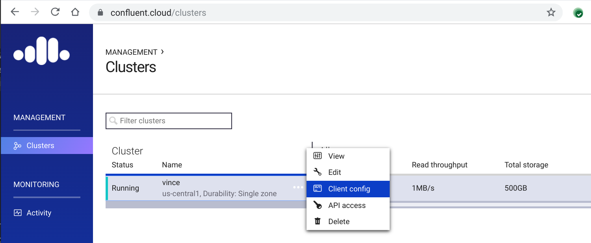

# Confluent Cloud on GCP 
This workshop attempts to illustrate how to use Confluent Cloud Platform on GCP

## Components
* Google Cloud Platform
* [Confluent Cloud Professional](https://confluent.cloud)
* [Confluent Platform](https://www.confluent.io/download/) (for local testing)
* [Confluent Schema Registry](https://docs.confluent.io/current/schema-registry/docs/index.html)
* [Kafka Connect](https://docs.confluent.io/current/connect/index.html)
    * [Kafka Connect IRC Source](https://github.com/cjmatta/kafka-connect-irc)
    * [Google Big Query Sink](https://github.com/wepay/kafka-connect-bigquery)
    * [Google Cloud Storage Sink](https://docs.confluent.io/current/connect/kafka-connect-gcs/index.html#kconnect-long-gcs)
* [Confluent KSQL](https://github.com/confluentinc/ksql)
* [Confluent Ansible scripts](https://github.com/cjmatta/cp-ansible/tree/ccloud-profiles)
* [Kafkacat](https://github.com/edenhill/kafkacat)

## Agenda
TODO

## Setup Environment

1. Clone this repository:

```bash
git clone https://github.com/cjmatta/Confluent-GCP-Workshop.git
cd Confluent-GCP-Workshop
```

1. Install ansible in a virtualenv

```bash
virtualenv env
source env/bin/activate
pip install ansible
```

1. Initialize a new cluster in Confluent Cloud. https://confluent.cloud/

1. Create some GCP hosts, we're using 2 n1-standard-2 (2 vCPUs, 7.5 GB memory, 200GB Persistent Disk). From Cloud Shell, you can create them like this (change `my-project` to your project ID if you're not using Cloud Shell or if you want to place the instances into a specific project):

```bash
PROJECT=${DEVSHELL_PROJECT_ID:=my-project}
ZONE=us-central1-c
for i in $(seq 2); do
    gcloud beta compute --project=${PROJECT} instances create confluent-cloud-${i} \
        --zone=${ZONE} \
        --machine-type=n1-standard-2 \
        --scopes=https://www.googleapis.com/auth/cloud-platform \
        --image=centos-7-drawfork-v20180327 \
        --image-project=eip-images \
        --boot-disk-size=200GB \
        --boot-disk-type=pd-standard \
        --boot-disk-device-name=confluent-cloud \
        --metadata enable-oslogin=TRUE
done
```

1. Ensure you have SSH keys set up in your home directory

We enabled OS Login on the new instances so that Ansible can use ssh to access them. If your project is brand new or you do not have google_compute_engine SSH keys, let's create them, then add them to os-login. Note that `gcloud compute config-ssh` will prompt you if you don't already have ssh keys set up in your cloud shell:

```bash
gcloud compute config-ssh
gcloud compute os-login ssh-keys add --key-file ~/.ssh/google_compute_engine.pub
```

1. Clone the Confluent Ansible repository

```bash
git clone https://github.com/cjmatta/cp-ansible
cd cp-ansible
git checkout ccloud-profiles
```

1. Use `gcloud compute instances list` to generate the hosts file you'll need for the ansible playbooks:

```bash
CP_HOSTS=$(gcloud compute instances list --format=json --filter="name~confluent-cloud"  |\
    jq -r '.[] | .name + " ansible_host=" + .networkInterfaces[0].accessConfigs[0].natIP')

cat >hosts<<EOF
${CP_HOSTS}

[preflight]
confluent-cloud-1
confluent-cloud-2
[schema-registry]
confluent-cloud-1
confluent-cloud-2
[connect-distributed]
confluent-cloud-1
confluent-cloud-2
[ksql]
confluent-cloud-1
confluent-cloud-2
EOF
```

Confirm that ansible can connect to your instances:

```bash
# N.B., disable host key checking so that you don't have to confirm addition of
# the host keys to your known_hosts file. Don't do this in production!
export ANSIBLE_HOST_KEY_CHECKING=False
ansible -i hosts --key-file=~/.ssh/google_compute_engine -m ping all
```

1. Install the ccloud tool and initialize the configuration with `ccloud init`. To obtain the information you need to supply to `ccloud init`, visit https://confluent.cloud/clusters and choose the cluster you just created. Click the triple-dot menu and select "Client Config" to access your broker endpoing and API credentials.



```bash
curl -L https://s3-us-west-2.amazonaws.com/confluent.cloud/cli/ccloud-latest.tar.gz | sudo tar -C /opt -vxzf -
PATH=$PATH:/opt/ccloud-0.2.1/bin/
ccloud init
```

1. Now, use the ccloud configuration to generate the variables file Ansible will use to configure your Compute Engine instances that will run Confluent Platform:

```bash
BOOTSTRAP_SERVER=$(cat ~/.ccloud/config | grep "bootstrap.servers" | awk -F= '{print $2}' | sed s/\\\\:/\:/g)
API_KEY=$(cat ~/.ccloud/config | grep jaas | awk '{print $3}' | awk -F= '{print $2}' | sed s/\;$//g)
API_SECRET=$(cat ~/.ccloud/config | grep jaas | awk '{print $4}' | awk -F= '{print $2}' | sed s/\;$//g)
OSLOGIN_USERNAME=$(gcloud compute os-login describe-profile --format json | jq -r '.posixAccounts[0].username')

cd cp-ansible && mkdir group_vars
cat >group_vars/all<<EOF
ansible_user: ${OSLOGIN_USERNAME}
ansible_connection: ssh
ansible_become: true
security_mode: ccloud
confluent:
    cloud:
        broker:
            endpoint: "SASL_SSL://${BOOTSTRAP_SERVER}"
        api:
            key: ${API_KEY}
            secret: ${API_SECRET}
EOF
```

1. Install Confluent Platform components on the GCP hosts

```bash
ansible-playbook --private-key=~/.ssh/google_compute_engine -i hosts gcp-workshop.yml
```

1. Install Connect plugins

```bash
ansible-playbook --private-key=~/.ssh/google_compute_engine -i hosts \
    -b --become-user=root install-connectors-playbook.yml
```

### Set up Kafka Connect Source

1. Create `wikipedia` topic:

```bash
ccloud topic create wikipedia --replication-factor 3 --partitions 3
```

1. Edit `submit_wikipedia_irc_config.sh` with schema registry IPs, and then submit the connector:

```bash
./submit_wikipedia_irc_config.sh <connect-distributed-host>
```

1. Check the status of the connector:

```bash
$ curl http://35.231.187.35:8083/connectors/wikipedia-irc/status | jq .
% Total    % Received % Xferd  Average Speed   Time    Time     Time  Current
                            Dload  Upload   Total   Spent    Left  Speed
100   169  100   169    0     0   1631      0 --:--:-- --:--:-- --:--:--  1640
{
"name": "wikipedia-irc",
"connector": {
    "state": "RUNNING",
    "worker_id": "10.142.0.5:8083"
},
"tasks": [
    {
    "state": "RUNNING",
    "id": 0,
    "worker_id": "10.142.0.6:8083"
    }
],
"type": "source"
}
```

4. Use the `kafka-avro-console-consumer` to test that data is flowing into the topic:

```bash
$ ${CONFLUENT_HOME}/bin/kafka-avro-console-consumer --bootstrap-server pkc-l9v0e.us-central1.gcp.confluent.cloud:9092 --consumer.config ~/.ccloud/config --topic wikipedia --property schema.registry.url=http://<schema-registry-ip>:8081
{"createdat":1536371033912,"wikipage":"Jo Hyun-jae","channel":"#en.wikipedia","username":"2.205.55.98","commitmessage":"","bytechange":36,"diffurl":"https://en.wikipedia.org/w/index.php?diff=858558341&oldid=855644132","isnew":false,"isminor":false,"isbot":false,"isunpatrolled":false}
--- snip ---
```

## KSQL
1. Log into one of the KSQL servers
2. Start KSQL CLI
    ```
    $ sudo ksql http://localhost:8088
    ```
3. Register the wikipedia topic as a stream:
    ```
    ksql> create stream wikipediasource with (kafka_topic='wikipedia', value_format='avro');

    Message
    ----------------
    Stream created
    ----------------
    ```

## Joins
This will demonstrate joining a stream of events to a table of dimensions for data enrichment. The stream of Wikipedia edits will be joined to a compacted topic consisting of channel -> language.

1. Create compacted topic to capture the lookup data:
    ```
    $ ccloud topic create wikipedia-language-map --partitions 3 --replication-factor 3 --config cleanup.policy=compact
    ```
2. Push lookup data into the topic using the `publish_language_map.sh` (requires [Kafkacat](https://github.com/edenhill/kafkacat)):
    ```
    $ ./publish_language_map.sh
    ```
3. Consume topic to ensure the data is there:
    ```
    $ kafkacat -F ~/.ccloud/config -b <broker endpoint>:9092 -C -t wikipedia-language-map -o beginning -K:
    ```
4. From KSQL CLI, register the topic as a **TABLE**:
    ```
    $ create table wikipedialanguages (channel varchar, language varchar) with (kafka_topic='wikipedia-language-map', value_format='delimited', key='channel');
    Message
    ---------------
    Table created
    ---------------
    ```
5. Select from the table:
    ```
    ksql> SET 'auto.offset.reset' = 'earliest';
    Successfully changed local property 'auto.offset.reset' from 'null' to 'earliest'
    ksql> select * from wikipedialanguages;
    1536429549813 | #en.wikipedia | #en.wikipedia | English
    1536429549813 | #fr.wikipedia | #fr.wikipedia | French
    1536429549813 | #es.wikipedia | #es.wikipedia | Spanish
    1536429549813 | #en.wiktionary | #en.wiktionary | English
    1536429549813 | #de.wikipedia | #de.wikipedia | German
    1536429549813 | #eo.wikipedia | #eo.wikipedia | Esperanto
    1536429549813 | #ru.wikipedia | #ru.wikipedia | Russian
    1536429549813 | #it.wikipedia | #it.wikipedia | Italian
    1536429549813 | #vo.wikipedia | #vo.wikipedia | Volapük
    1536429549813 | #zh.wikipedia | #zh.wikipedia | Chinese
    1536429549813 | #sd.wikipedia | #sd.wikipedia | Arabic
    1536429549813 | #mediawiki.wikipedia | #mediawiki.wikipedia | English
    1536429549813 | #commons.wikimedia | #commons.wikimedia | English
    1536429549813 | #eu.wikipedia | #eu.wikipedia | English
    1536429549813 | #uk.wikipedia | #uk.wikipedia | English
    ```

6. Create an enriched stream by joining the edits to the language topic:
    ```sql
    create stream wikipediaedits with ( \
        value_format = 'avro' \
    ) as \
    select \
        w.createdat, \
        w.wikipage, \
        w.channel channel, \
        w.username, \
        w.commitmessage, \
        w.bytechange, \
        w.diffurl, \
        w.isnew, \
        w.isminor, \
        w.isbot, \
        w.isunpatrolled, \
        l.language \
    from \
        wikipediasource w \
        INNER JOIN wikipedialanguages l on w.channel = l.channel;

    ```

### Set up Sinks
#### Google Big Query Sink
1. Create service account, and download the authentication json file
2. Copy keyfile to the connect hosts:
    `$ ansible -i hosts.gcp-workshop.yml --private-key=~/.ssh/google_compute_engine -m copy -a "src=<path to keyfile> dest=/etc/kafka/gbq-keyfile.json" connect-distributed`
3. Edit `submit_google_big_query_config.sh` with Schema Registry ips, and then submit the config:
    ```
    $ ./submit_google_big_query_config.sh <connect host ip>
    ```

